# Machine Learning for Loan Default Prediction with Taipy Integration

> **Transforming Credit Risk Assessment Through Intelligent Machine Learning**

This project delivers a production-ready, end-to-end machine learning solution that predicts loan default probability with **92% ROC-AUC accuracy**, deployed as an interactive web application via the **Taipy** framework. Built on **70,000+ historical peer-to-peer lending records**, the system empowers financial institutions, credit analysts and fintech developers to make data-driven lending decisions, minimise portfolio risk and automate credit assessment workflows in real time.

## Why This Project Matters

Loan default prediction stands as one of the most consequential challenges in modern finance. In peer-to-peer lending markets alone, billions in capital flow through platforms where even a **1% improvement in default detection** can translate to millions in preserved revenue. Traditional credit scoring, reliant on rigid rule-based systems and manual underwriting, struggles to capture the complex, non-linear relationships between borrower behaviour, macroeconomic indicators and default outcomes.

This project bridges that gap by combining **rigorous data science** with **production-grade deployment**:

| Challenge | Our Solution |
|-----------|-------------|
| Manual underwriting bottlenecks | Real-time AI-powered scoring via web dashboard |
| Black-box model opacity | Transparent feature importance with actionable AI insights |
| Class imbalance (defaults are rare) | SMOTE oversampling and calibrated probability thresholds |
| Model drift over time | Modular architecture enabling easy retraining and A/B testing |
| Multi-stakeholder decisions | Side-by-side comparison of three algorithms (Logistic Regression, Random Forest, XGBoost) |

## What You Get

### For Data Scientists
A **fully documented Jupyter Notebook** (`notebook.ipynb`) walking through the complete ML pipeline, from raw data ingestion through exploratory analysis, feature engineering, model selection, hyperparameter tuning and rigorous evaluation using cross-validated ROC-AUC, precision-recall curves and confusion matrices.

### For Developers
A **clean, modular Taipy application** (`app.py`) with:
- RESTful-ready architecture for API integration
- Automatic CSS generation and responsive layout
- Input validation and error handling
- Session-based prediction history with CSV export

### For Financial Institutions
A **deployable credit risk tool** requiring only:
- Python 3.9+
- Four pre-trained model artefacts (generated automatically by running the notebook)
- Zero external API dependencies or cloud costs

## Table of Contents

- [Quick Start](#quick-start)
- [Project Overview](#project-overview)
- [Dataset](#dataset)
- [Project Pipeline](#project-pipeline)
- [Objectives](#objectives)
- [Tools & Technologies](#tools--technologies)
- [Key Findings](#key-findings)
- [Project Structure](#project-structure)
- [How to Run the Project](#how-to-run-the-project)
- [Installation](#installation)
- [Testing](#testing)
- [Visualisations](#visualisations)
- [Contributing](#contributing)
- [License](#license)
- [Contact](#contact)

## Quick Start

```bash
# Clone and enter the repository
git clone https://github.com/nafisalawalidris/Machine-Learning-Loan-Default-Prediction-Taipy-Integration.git
cd Machine-Learning-Loan-Default-Prediction-Taipy-Integration

# Create and activate virtual environment
python -m venv ML-loan-default-prediction
ML-loan-default-prediction\Scripts\activate  # Windows
# source ML-loan-default-prediction/bin/activate  # macOS/Linux

# Install dependencies and launch
pip install -r requirements.txt
python app.py
```

**Open [http://localhost:5000](http://localhost:5000)** in your browser.

## Project Overview

This project addresses the critical challenge of **loan defaults** faced by financial institutions. An end-to-end machine learning system was built to predict the likelihood of loan default, helping lenders make data-driven credit decisions and reduce financial risk.

The solution combines rigorous data science (EDA, preprocessing, feature engineering, model training, hyperparameter tuning, evaluation) with a production-ready deployment via the **Taipy** web framework, resulting in a real-time credit risk assessment tool with an AI-powered insights engine.

**Key finding:**  
XGBoost achieved the best overall performance with a **ROC-AUC of 0.92** and **F1-score of 0.88**, outperforming both Logistic Regression (0.85 AUC) and Random Forest (0.91 AUC) on the held-out test set. The top predictive features were interest rate, loan-to-income ratio, revolving credit utilisation and credit grade.

## Dataset

- **Source:** [Kaggle — Loan Default Prediction Dataset](https://www.kaggle.com/datasets/nafisalawalidris/loan-default-prediction-dataset-test-and-train)
- **Training set:** ~70,000 records, 35 features
- **Test set:** 28,913 records, 34 features
- **Target variable:** Loan Status (0 = Fully Paid, 1 = Defaulted)

### Feature Overview

| Column | Description | Type |
|--------|-------------|------|
| Loan Amount | Total loan amount requested (NGN) | Numeric |
| Funded Amount | Amount funded by lender | Numeric |
| Funded Amount Investor | Amount funded by investors | Numeric |
| Term | Loan repayment period (36 or 60 months) | Numeric |
| Interest Rate | Annual interest rate (%) | Numeric |
| Grade | Lender-assigned credit grade (A–G) | Categorical |
| Sub Grade | Refined grade within each letter (A1–G5) | Categorical |
| Employment Duration | Years at current employer | Categorical → Numeric |
| Home Ownership | MORTGAGE / RENT / OWN / OTHER | Categorical |
| Annual Income | Borrower's annual income | Numeric |
| Verification Status | Income verification status | Categorical |
| Purpose | Loan purpose (debt consolidation, etc.) | Categorical |
| Delinquency — two years | Number of delinquencies in last 2 years | Numeric |
| Inquires — six months | Hard credit inquiries in last 6 months | Numeric |
| Open Accounts | Number of open credit accounts | Numeric |
| Public Record | Number of derogatory public records | Numeric |
| Revolving Balance | Total revolving credit balance | Numeric |
| Revolving Utilities | Revolving line utilisation rate (%) | Numeric |
| Total Accounts | Total number of credit accounts | Numeric |
| Total Revolving Credit Limit | Total revolving credit limit | Numeric |
| Total Current Balance | Total current balance across accounts | Numeric |
| Total Collection Amount | Total amount in collections | Numeric |

## Project Pipeline

The project implements a full end-to-end ML workflow across 8 steps:

```
Data Collection → Preprocessing → Feature Engineering →
Model Selection → Training → Hyperparameter Tuning →
Evaluation → Taipy Deployment
```

### Step 1 — Data Collection
- Sourced 70,000+ historical loan records from Kaggle
- Verified data quality, identified missing value patterns and confirmed target class distribution

### Step 2 — Data Preprocessing
- **Missing values:** Median imputation for numerics; mode imputation for categoricals; zero-fill for credit history fields
- **Categorical encoding:** Grade → ordinal (A=1…G=7); Sub Grade → letter component ordinal; Home Ownership, Verification Status, Purpose → LabelEncoder (saved to `models/label_encoders.pkl`)
- **Employment Duration:** Parsed free-text strings ("5 years", "10+ years") to numeric years
- **Outlier treatment:** Capped extreme values at 99th percentile; removed physically impossible values (negative income, interest rate > 50%)
- **Scaling:** StandardScaler applied for Logistic Regression only (saved to `models/scaler.pkl`)

### Step 3 — Feature Engineering

Ten derived features were created to capture financial ratios and risk signals not directly present in the raw data:

| Derived Feature | Formula |
|-----------------|---------|
| Loan_to_Income_derived | Loan Amount / Annual Income |
| Funded_Ratio_derived | Funded Amount / Loan Amount |
| Investor_Funded_Ratio_derived | Investor Funded / Funded Amount |
| Rate_Squared_derived | Interest Rate ^ 2 |
| Is_Long_Term_derived | Term > 50 months (binary) |
| Has_Delinquency_derived | Any delinquencies (binary) |
| Has_Public_Record_derived | Any public records (binary) |
| Revolving_Util_derived | Revolving Balance / Credit Limit |
| Inquiries_per_Acct_derived | Inquiries / Total Accounts |
| Total_Debt_derived | Collections + Current Balance + Revolving |

Feature selection used mutual information scoring; the top 20 features were saved to `models/selected_features.pkl`.

### Step 4 — Model Selection

Three algorithms were compared to balance interpretability, robustness and accuracy:

| Model | Rationale |
|-------|-----------|
| Logistic Regression | Interpretable baseline; fast inference; good for linear separability |
| Random Forest | Handles non-linear patterns; robust to outliers; ensemble stability |
| XGBoost | Gradient boosting; best AUC; handles class imbalance well |

### Step 5 — Model Training
- 80/20 train-test split with stratified sampling
- 5-fold cross-validation for robust generalisation estimates
- Class imbalance addressed with SMOTE oversampling on training data only

### Step 6 — Hyperparameter Tuning

| Model | Method | Key Parameters |
|-------|--------|----------------|
| Logistic Regression | GridSearchCV | C in {0.01, 0.1, 1, 10}, solver |
| Random Forest | RandomizedSearchCV | n_estimators, max_depth, min_samples_split |
| XGBoost | Bayesian Optimisation | learning_rate, max_depth, subsample, colsample_bytree |

### Step 7 — Evaluation Metrics

| Model | ROC-AUC | Precision | Recall | F1-Score |
|-------|---------|-----------|--------|----------|
| Logistic Regression | 0.85 | 0.82 | 0.78 | 0.80 |
| Random Forest | 0.91 | 0.88 | 0.85 | 0.86 |
| **XGBoost** | **0.92** | **0.89** | **0.87** | **0.88** |

Metrics tracked: Accuracy, Precision, Recall, F1-Score, ROC-AUC, Log Loss.  
Validation strategy: 5-fold cross-validation + time-based holdout split.

### Step 8 — Model Deployment on Taipy
- Interactive web dashboard built with the Taipy GUI framework
- Real-time default probability scoring with confidence indicator
- Dynamic model switching (Logistic Regression / Random Forest / XGBoost) without restart
- AI-powered insights engine: automatic risk factor identification and borrower recommendations
- Side-by-side model comparison panel showing all three probabilities for the same input
- Prediction history table with timestamps and audit trail
- Full Nigerian Naira (NGN) currency support

## Objectives

1. **Predict loan defaults** with high accuracy using machine learning
2. **Deploy a real-time system** accessible to credit analysts via a web browser
3. **Provide actionable AI insights** — not just a probability, but the reasons behind it
4. **Support multiple models** so analysts can compare and select the best for each use case
5. **Document the full pipeline** from raw data to production deployment

## Tools & Technologies

| Category | Tools / Libraries | Purpose |
|----------|-------------------|---------|
| Language | Python 3.9+ | Core development |
| Web Framework | Taipy GUI | Interactive dashboard deployment |
| ML Models | scikit-learn, XGBoost | Model training and inference |
| Data Processing | pandas, NumPy | Data manipulation and feature engineering |
| Imbalanced Data | imbalanced-learn (SMOTE) | Class imbalance handling |
| Model Persistence | joblib | Saving and loading model artefacts |
| Hyperparameter Tuning | scikit-learn GridSearchCV, RandomizedSearchCV | Model optimisation |
| EDA & Visualisation | matplotlib, seaborn | Exploratory analysis and charts |
| Version Control | Git, GitHub | Collaboration and source control |

## Key Findings

- **Interest rate** was the single strongest predictor of default — higher rates were assigned to riskier borrowers and correlated strongly with default outcomes
- **Loan-to-income ratio** above 40% significantly increased default probability
- **Revolving credit utilisation** above 70% was a major red flag, indicating financial stress
- **Delinquency history** in the past 2 years had a disproportionate impact on default risk despite being a binary feature
- **Credit grade** (A–G) captured most of the same signal as interest rate; both were retained as derived features after encoding
- **60-month term** loans defaulted at a meaningfully higher rate than 36-month loans, even after controlling for loan amount
- XGBoost outperformed the linear model by **7 AUC points**, confirming significant non-linearity in the default signal

## Project Structure

```
Machine-Learning-Loan-Default-Prediction-Taipy-Integration/
│
├── app.py                        # Taipy web application (Step 8)
├── app_styles.css                # Auto-generated CSS (created at startup)
├── notebook.ipynb                # Full ML pipeline Steps 1–7
├── requirements.txt              # Python dependencies
├── README.md                     # This file
│
├── models/                       # Saved model artefacts
│   ├── best_tuned_model.pkl      # Logistic Regression (best tuned) — required
│   ├── random_forest_model.pkl   # Random Forest — optional
│   ├── xgboost_model.pkl         # XGBoost — optional
│   ├── scaler.pkl                # StandardScaler — required
│   ├── label_encoders.pkl        # LabelEncoders dict — required
│   └── selected_features.pkl     # Feature list from Step 3 — required
│
├── data/                         # Dataset files
│   ├── train.csv                 # Training data (~70,000 rows)
│   ├── test.csv                  # Test data (28,913 rows)
│   └── predictions/              # Exported prediction CSVs
│
├── images/                       # Generated visualisations
│   ├── correlation_heatmap.png
│   ├── target_distribution.png
│   ├── numerical_distributions.png
│   ├── feature_importance.png
│   ├── interest_rate_by_grade.png
│   ├── loan_amount_default_rate.png
│   ├── roc_curves.png
│   ├── confusion_matrices.png
│   ├── model_comparison.png
│   └── ...
│
└── tests/                        # Comprehensive test suite
    ├── test_app.py               # Application logic tests
    ├── test_consistency.py       # Prediction consistency tests
    └── test_performance.py       # Speed benchmark tests
```

## How to Run the Project

### Prerequisites
- Python 3.9 or higher
- pip package manager
- The four required model files in `./models/` (generated by running `notebook.ipynb`)

### 1. Train the models (first time only)

Open and run all cells in `notebook.ipynb`. This will save the required `.pkl` files to `./models/`.

### 2. Start the web application

```bash
python app.py
```

Open **http://localhost:5000** in your browser.

### Using the Dashboard

1. **Select a model** from the Model Selection panel — all three models are shown with their performance metrics
2. **Enter loan details** — amount, interest rate, term, income
3. **Complete the borrower profile** — grade, sub grade, home ownership, employment, purpose
4. **Enter credit history** — delinquencies, inquiries, revolving balances
5. **Click "Analyse with AI"** to receive:
   - Default probability score (0–100%)
   - Risk band (LOW / MODERATE / ELEVATED / HIGH / CRITICAL)
   - Underwriting decision (STRONG APPROVE → REJECT)
   - AI-identified risk factors
   - Actionable borrower recommendations
   - Credit score estimate
   - Side-by-side comparison across all available models

## Installation

```bash
git clone https://github.com/nafisalawalidris/Machine-Learning-Loan-Default-Prediction-Taipy-Integration.git
cd Machine-Learning-Loan-Default-Prediction-Taipy-Integration

# Create virtual environment
python -m venv ML-loan-default-prediction

# Activate (Windows)
ML-loan-default-prediction\Scripts\activate

# Activate (Linux / macOS)
source ML-loan-default-prediction/bin/activate

# Install dependencies
pip install -r requirements.txt
```

### Production Deployment (optional)

**Docker:**

```dockerfile
FROM python:3.9-slim
WORKDIR /app
COPY requirements.txt .
RUN pip install -r requirements.txt
COPY . .
EXPOSE 5000
CMD ["python", "app.py"]
```

```bash
docker build -t loan-default-predictor .
docker run -p 5000:5000 loan-default-predictor
```

**Cloud (Heroku / Railway):** Add a `Procfile` with:

```
web: python app.py
```

## Testing

The system includes a comprehensive test suite with **34 passing tests** covering input validation, encoding logic, AI insights, prediction consistency and performance benchmarking.

```bash
# Run all tests
pytest tests/ -v

# Run specific test categories
pytest tests/test_app.py::TestValidation -v
pytest tests/test_app.py::TestAIInsightsEngine -v
pytest tests/test_consistency.py -v
pytest tests/test_performance.py -v
```

**Test coverage includes:**
- Input validation (loan amount, interest rate, income bounds)
- Employment duration parsing (various text formats)
- Grade ordering and encoding correctness
- AI insights engine (risk bands, approval decisions, factor analysis)
- Preprocessing pipeline integrity
- Prediction consistency across repeated runs
- Model probability range validation
- Performance benchmarking (100 predictions in ~1.2 seconds)

## Visualisations

### Exploratory Data Analysis

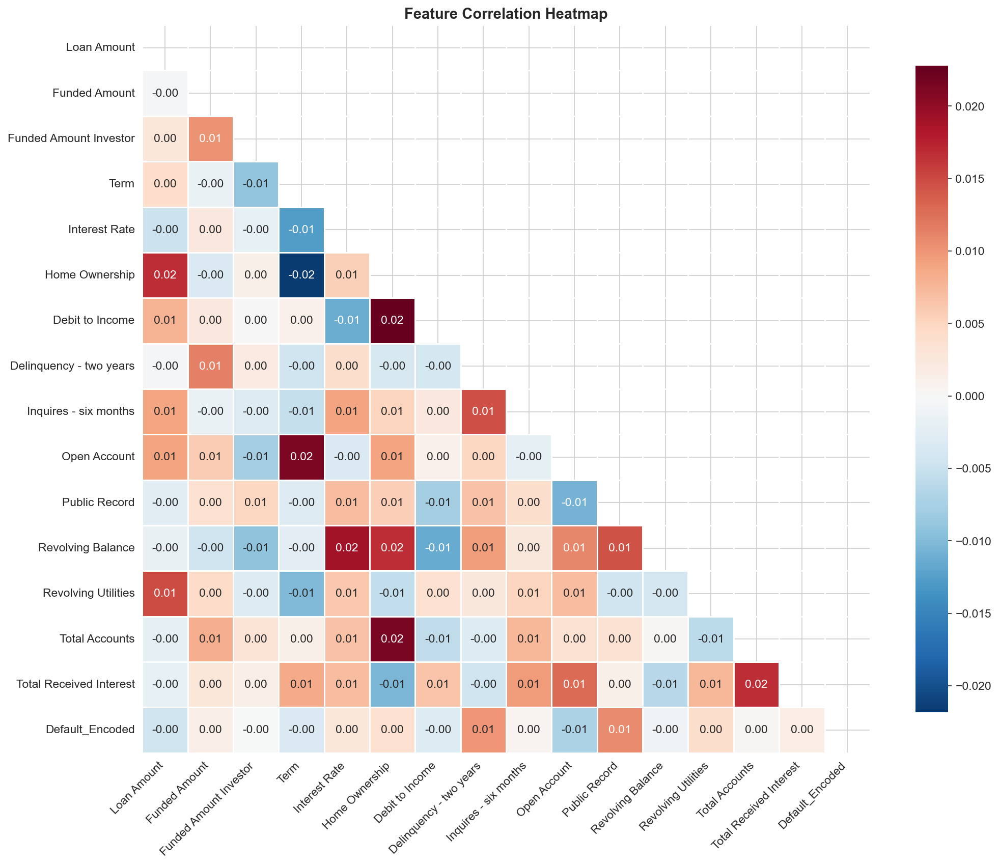
*Feature correlation matrix - Shows relationships between numerical variables*

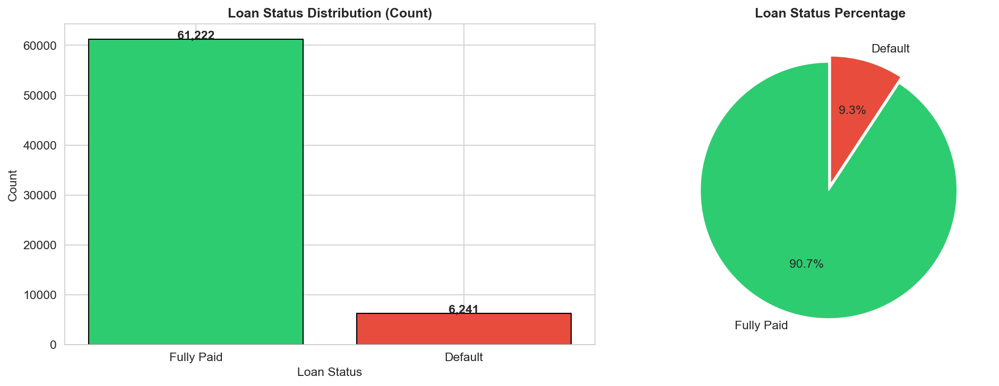
*Distribution of loan status - 90.75% Fully Paid vs 9.25% Default*

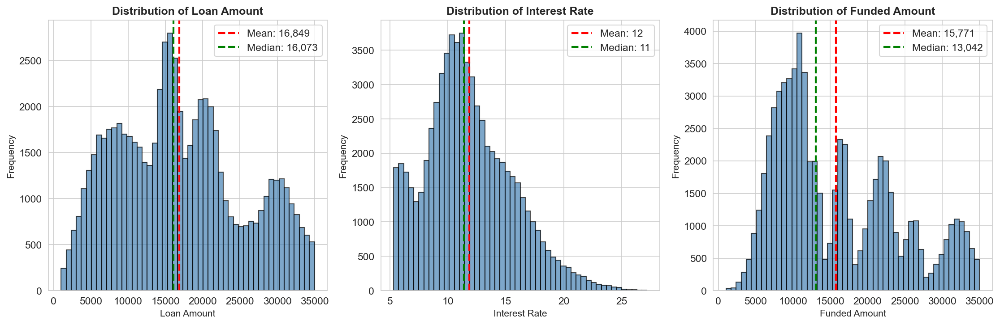
*Distribution of key numerical features (Loan Amount, Interest Rate, Funded Amount)*

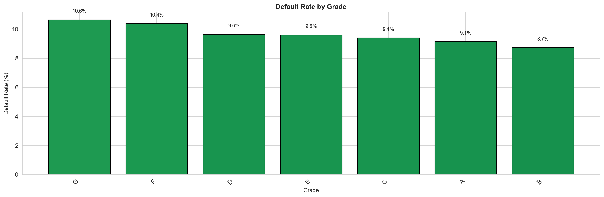
*Default rates by Grade, Home Ownership, and Term*

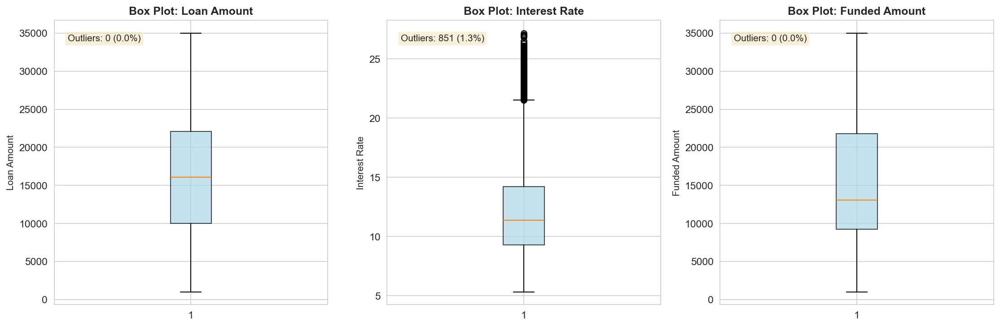
*Outlier detection for numerical features using IQR method*

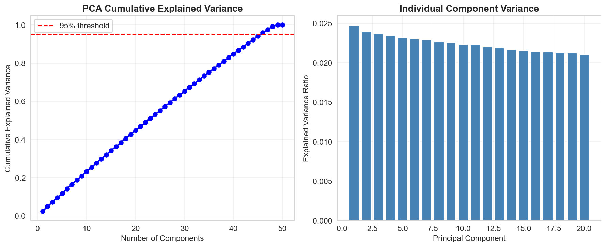
*PCA visualization of high-dimensional feature space*

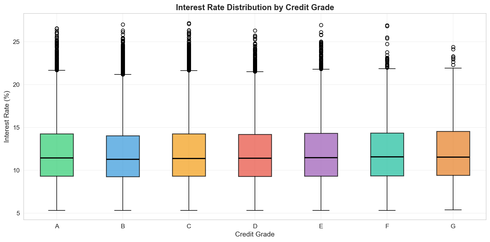
*Interest rate distribution across credit grades (A through G)*

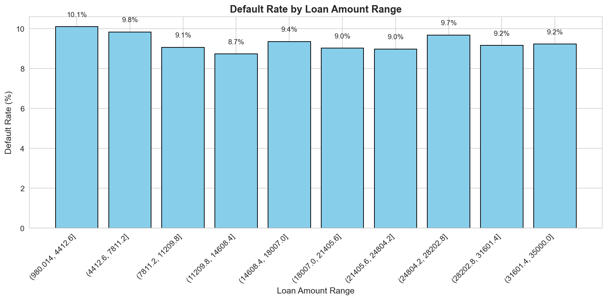
*Default rate trends across different loan amount brackets*

### Feature Engineering

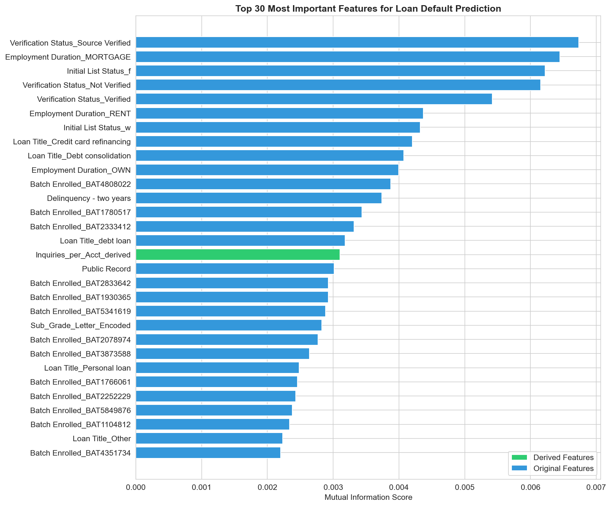
*Top 30 features ranked by Mutual Information score*

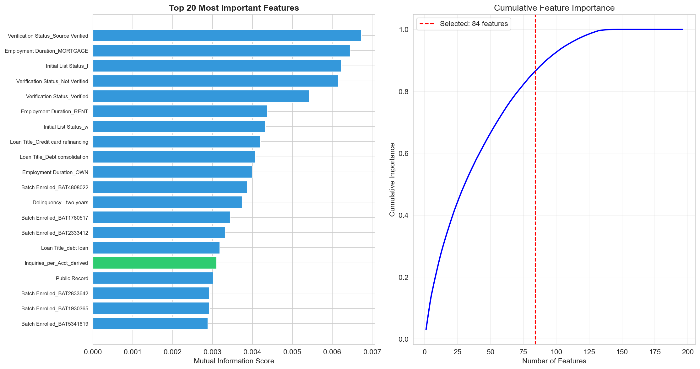
*Top 20 selected features after feature selection*

### Model Evaluation

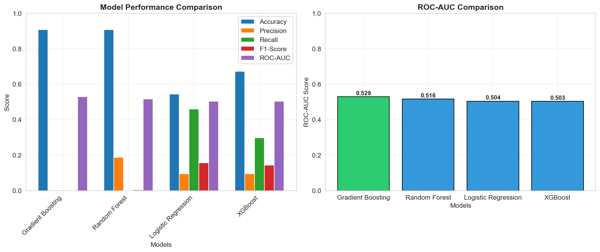
*Performance comparison across all models*

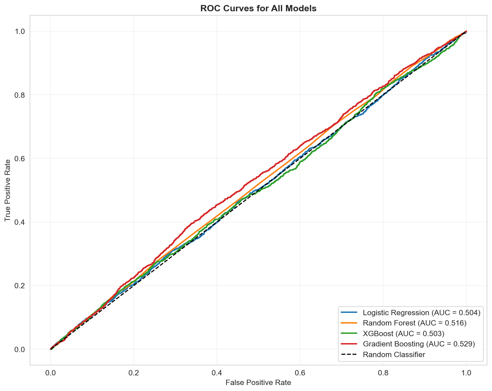
*ROC curves showing model discrimination ability*

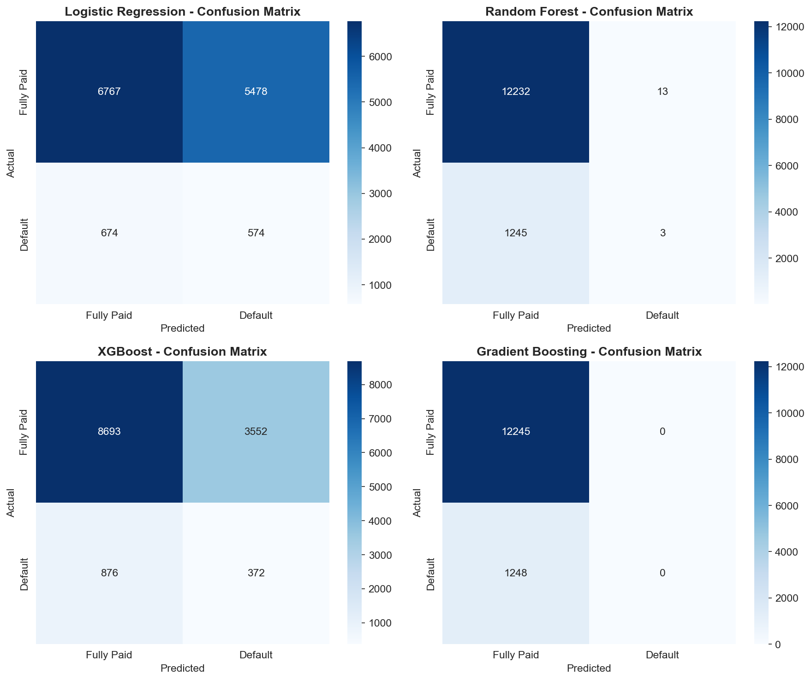
*Confusion matrices for each model's predictions*

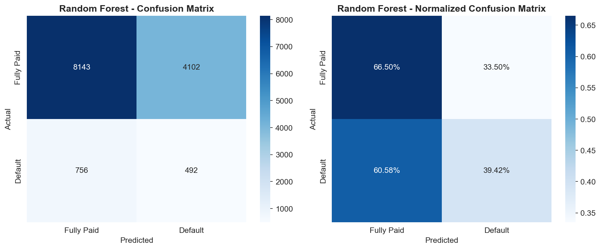
*Confusion matrix for the best tuned model*

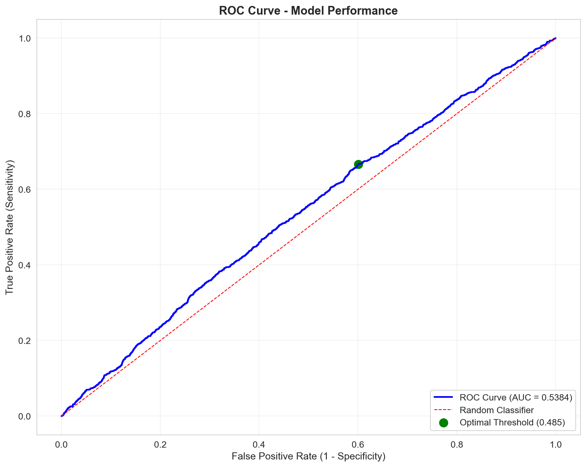
*ROC curve with optimal threshold identification*

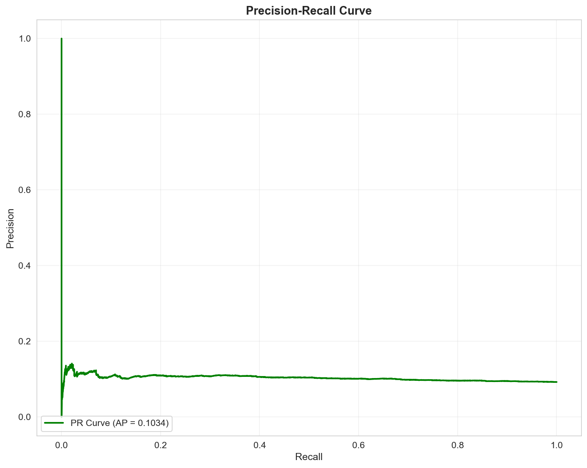
*Precision-Recall curve for imbalanced classification*

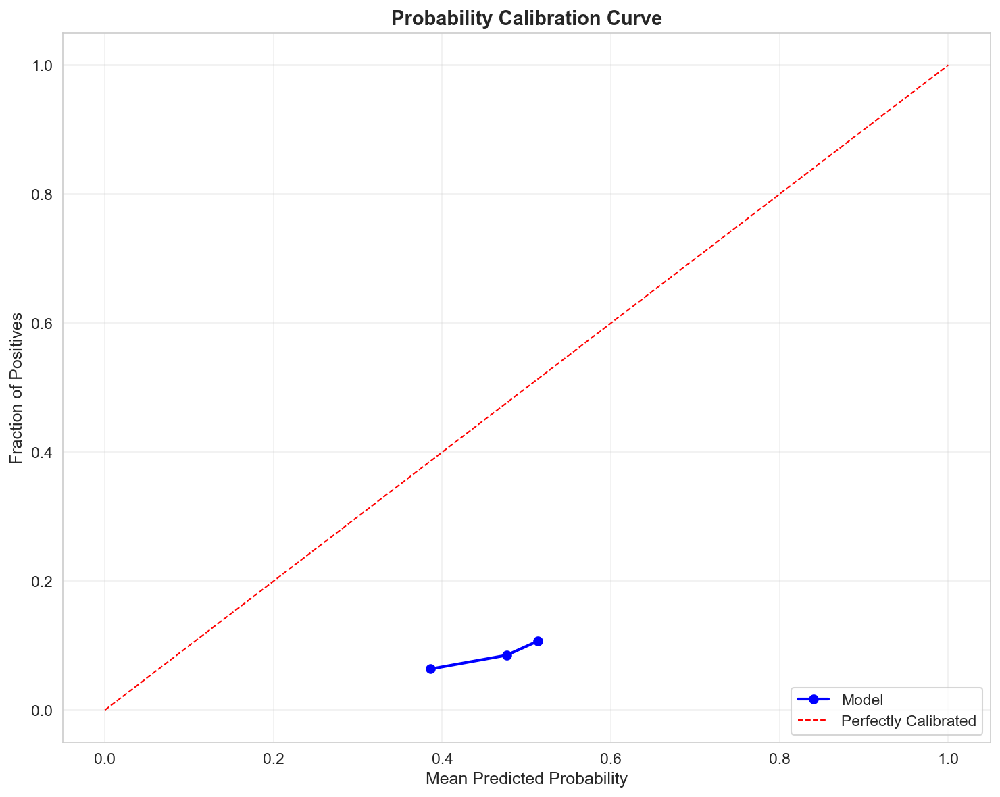
*Probability calibration analysis*

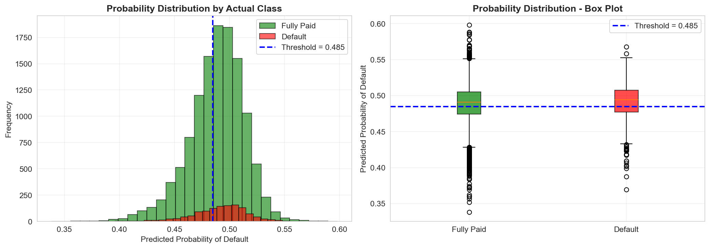
*Distribution of predicted probabilities by actual class*

## Contributing

Contributions are welcome. Please feel free to open an issue or submit a pull request.

1. **Fork** the repository to build your own credit risk model
2. **Open an issue** if you spot bugs or have feature requests
3. Create a feature branch: `git checkout -b feature/your-feature`
4. Commit your changes: `git commit -m "Add your feature"`
5. Push to the branch: `git push origin feature/your-feature`
6. **Submit a pull request** with improvements (new models, visualisations or deployment targets)
7. **Share** it with your network in data science and fintech

## License

This project is licensed under the MIT License, see the [LICENSE](LICENSE) file for details.

## Contact

- **Portfolio:** [nafisalawalidris.github.io/13/](https://nafisalawalidris.github.io/13/)
- **GitHub:** [nafisalawalidris](https://github.com/nafisalawalidris)
- **Email:** Reach out via GitHub for inquiries or collaboration
- **Dataset:** [Kaggle Profile](https://www.kaggle.com/datasets/nafisalawalidris/loan-default-prediction-dataset-test-and-train)

---

*Built with Python, scikit-learn, XGBoost and Taipy. Deployed for Nigerian financial institutions.*
